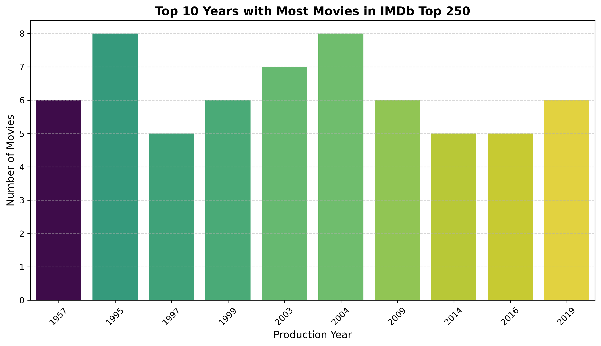

# IMDb Top 250 Web Scraping & Data Analysis

An end-to-end data project focused on scraping movie data using Selenium, cleaning and structuring it with Pandas, and generating insights and visualizations.

## 📊 Data Visualizations

**1. Ratings Distribution:**

**2. Top Production Years:**

## 🛠️ Tech Stack
* Python (Selenium, Pandas)
* Seaborn / Matplotlib
* Excel
